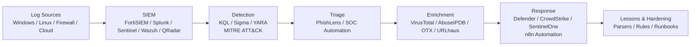

<!-- Premium Cybersecurity Header -->

<!-- Typing Introduction -->

 

<!-- Quick Badges -->

  

---

### 🛡️ About Me

> Cybersecurity Engineer with **1+ year of hands-on experience** supporting a **banking client in a 24×7 SOC environment** at **TechOwl InfoSec**. Focused on SOC operations, SIEM engineering, threat detection, and security automation.

I work at the intersection of **detection engineering, incident response, and automation** — turning noisy alerts into high-fidelity, explainable, and actionable security outcomes. My approach is practical, evidence-driven, and aligned to **MITRE ATT&CK**.

- 🎓 **B.Com (Computers)** — Kakatiya University, 2025
- 🛡️ Currently working as **Cyber Security Engineer @ TechOwl InfoSec**
- 🔍 Daily work: SIEM monitoring, alert triage, phishing investigation, IOC enrichment, parser & rule development
- 🧠 Builder mindset: I create tools that SOC analysts actually want to use
- 📍 Based in **India** — open to SOC Analyst / Security Engineer / Detection Engineering roles

---

### 🎯 Current Focus & Specialization

| Area | What I Do |
| :--- | :--- |
| **SOC Operations** | 24×7 monitoring, triage, escalation, and incident lifecycle management |
| **SIEM Engineering** | FortiSIEM, Splunk, Microsoft Sentinel, Wazuh, QRadar — parsers, correlation rules, use-case design |
| **Threat Detection** | Detection logic with KQL, Sigma, YARA, MITRE ATT&CK mapping |
| **Incident Response** | Phishing, brute-force, unauthorized access, endpoint compromise investigation |
| **Security Automation** | Python, PowerShell, n8n — alert enrichment, IOC automation, response workflows |
| **Vulnerability Management** | Nessus, OpenVAS, Nmap — assessment and risk prioritization |

---

### 🧰 Core Skills — Grouped by Domain

#### SIEM & Security Monitoring

`IBM QRadar` • `Elastic SIEM` • `KQL`

#### Endpoint Security & Detection Engineering

`SentinelOne` • `Sigma` • `YARA` • `MITRE ATT&CK`

#### Threat Intelligence & OSINT
`VirusTotal` • `AbuseIPDB` • `URLhaus` • `AlienVault OTX` • `ThreatFox` • `CISA KEV` • `GreyNoise`

#### Security Testing & Network Analysis
`Nessus` • `OpenVAS` • `Burp Suite` • `OWASP ZAP` • `Nmap` • `Metasploit` • `Wireshark` • `Suricata`

#### Cloud / Scripting / Automation

  

`PowerShell` • `n8n` • `tcpdump` • `Python` • `AWS` • `Azure` • `Docker` • `Git` • `GitHub`

---

### 🏅 Certifications & Achievements

| Certification / Achievement | Issuer / Platform | Year / Status |
| :--- | :--- | :--- |
| **Microsoft Certified: Security Operations Analyst Associate (SC-200)** | Microsoft | Certified |
| **FortiSIEM 7.4 Analyst Self-Paced Training** | Fortinet | Completed |
| **TryHackMe Top 1%** | TryHackMe | Global Ranking |
| **TryHackMe SOC Level 1** | TryHackMe | Completed |
| **TryHackMe SOC Level 2** | TryHackMe | Completed |
| **Blue Team Labs Online Top 6%** | BTLabs | Global Ranking |

> Verified via provided details and portfolio. No invented certifications added.

---

### 🚀 Featured Cybersecurity Projects

#### 1. PhishLens — Email Security / Phishing Detection
**Repo:** https://github.com/SadashivPole/phishlens-email-security  
**Stack:** Python, MIME parsing, VirusTotal API, AbuseIPDB API, IOC extraction

> Local-first, explainable email-analysis tool for SOC triage. Turns an `.eml` message into a bounded risk score, cautious verdict (CLEAN / SUSPICIOUS / UNRESOLVED / MALICIOUS architecture), explicit per-area completeness states, IOC records (IP, domain, URL, SHA-256), and provenance-backed evidence. All local detection and scoring is deterministic; optional VirusTotal and AbuseIPDB lookups add evidence records without changing the verdict.

**Highlights:**
- Bounded stdlib MIME parser with attachment metadata (SHA-256, magic-byte type)
- Deterministic analyzers: identity/auth headers, Received flow, URLs, content, attachments
- IOC extraction & normalization with provenance
- KQL / Sigma-friendly evidence output and safe JSON reports
- MIT license, v1.3.0 — no LLM in pipeline, no sensitive data exfiltration

---

#### 2. SOC Alert Triage Automation
**Repo:** https://github.com/SadashivPole/soc-alert-triage-automation  
**Stack:** Wazuh, n8n, Python, VirusTotal, MISP, FastAPI

> AI-assisted SOC alert triage and incident response automation using Wazuh, n8n, Python, and threat intelligence. Implements ingest API, normalization & deduplication, IOC extraction, enrichment (VirusTotal / MISP with fail-open), scoring, decision policy, correlation into investigation contexts, and analyst explainability.

**Highlights:**
- Real ingest API (`/api/v1/alerts/ingest`) with idempotency & recurrence handling
- Deterministic scoring with golden-file tests
- Detection coverage framework + MITRE ATT&CK mapping (`attack_mappings.yaml`)
- Evaluation corpus: 24 scenarios, precision/recall/F1 quality gates in CI
- Investigation contexts: correlation by indicator, IP, agent + ATT&CK technique

---

#### 3. AI-Powered Phishing Detection Agent
**Post:** https://www.linkedin.com/posts/sadashiv-pole_cybersecurity-threatintelligence-automation-activity-7385657634605110000-cxXQ/  
**Stack:** n8n, Google Gemini 2.5, IMAP, JavaScript, REST APIs

> Autonomous phishing detection agent that monitors inbound emails via IMAP, runs AI-driven analysis using Google Gemini, and delivers real-time SOC alerts. Designed to reduce analyst workload while handling high email volume.

*Description sourced from portfolio and LinkedIn post — no performance metrics invented beyond what is documented in your portfolio.*

---

#### 4. Automated IOC Enrichment System
**Stack:** n8n, VirusTotal API, AbuseIPDB API, Slack, REST APIs  
**Reference:** Detailed as Project 02 on portfolio — [sadashiv-pole-zvwta6d.gamma.site](https://sadashiv-pole-zvwta6d.gamma.site)

> Automated ingestion of suspicious IPs and file hashes from SIEM alerts. Enriched in real-time via VirusTotal and AbuseIPDB APIs, with critical threats routed instantly to Slack — eliminating manual lookups during triage. Implementation aligns with portfolio Project 02 description (SIEM alert enrichment workflow).

---

**More on Portfolio →** [sadashiv-pole-zvwta6d.gamma.site](https://sadashiv-pole-zvwta6d.gamma.site)

---

### 🛡️ Security Operations Stack — At a Glance

---

### 📊 GitHub Analytics

 

---

### 🐍 Contribution Activity

<!-- Snake animation generated by .github/workflows/snake.yml to output branch -->

---

### 📫 Connect & Contact

  

**B.Com (Computers), Kakatiya University (2025) | India | SOC Operations | SIEM | Threat Detection | Security Automation**

*Open to SOC Analyst, Cybersecurity Engineer, and Detection Engineering opportunities*

---

Built with focus on readability, credibility, and technical depth — no fake stats, no copied bios.

